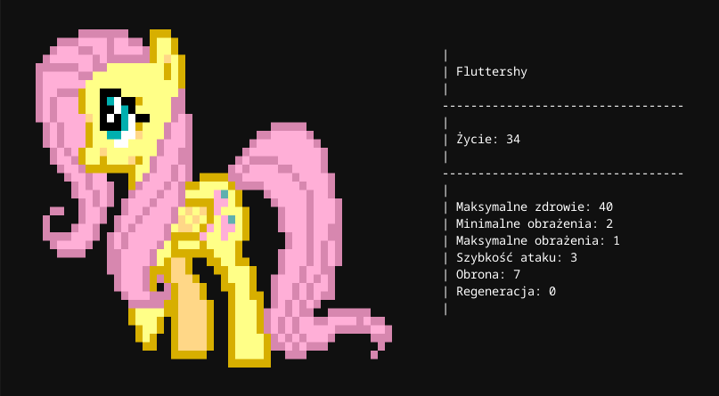

# Funkcje

## Ładowanie danych z bazy

### Załaduj kucyka
- `Pony load_pony(DbConnection db, int id)`
- `Pony load_pony(DbConnection db, const std::string& name)`

Ładuje kucyka po id albo po nazwie.  
Gdy nie ma takiego kucyka, wyrzucany jest `std::runtime_error`.

### Załaduj wszystkie kucyki
- `std::vector<Pony> load_all_ponies(DbConnection db)`

## Zapisywanie kucyków

### Tworzenie kucyka
- `Pony create_pony(DbConnection db, const std::string& name)`

Tworzy nowego kucyka o podanej nazwie i zwraca jego obiekt.  
Może wyrzucić `std::runtime_error`, gdy kucyk o podanej nazwie juz istnieje.

### Aktualizacja kucyka
- `void update_pony(DbConnection db, const Pony& pony)`

Aktualizuje informacje o kucyku w bazie.

### Usuwanie kucyka
- `void delete_pony(DbConnection db, int id)`

Usuwa kucyka o podanym id.  
Po usunięciu, użycie `update_pony(db, pony)` lub `delete_pony(db, id)` na
usuniętym kucyku wyrzuci `std::runtime_error`.  
Próba usunięcia nieistniejącego kucyka wyrzuci `std::runtime_error`.

## Wyświetlanie kucyków

- `void draw_pony(const Pony& pony)`

Wyświetla obrazek kucyka na podstawie jego nazwy i jego statystyki.

